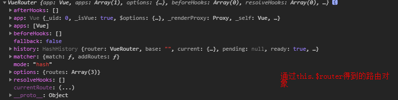
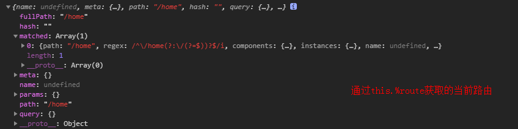

# 概述
Vue2.x学习笔记
# 参考
[Vue](https://cn.vuejs.org/)
[vueRouter](https://router.vuejs.org/zh/installation.html)

# VueRouter

## 安装使用

1.先下载，然后通过`script`引入或者直接只用CDN
```
<script src="../plugins/vue/vue.js"></script>
<script src="../plugins/vue/vue-router.js"></script>
```

2.通过`npm`安装
```
// 下载包
npm install vue-router
// 引入
import Vue from 'vue'
import VueRouter from 'vue-router'
// 在工程的项目中使用路由需要使用Vue.use()明确的安装
Vue.use(VueRouter)
```
## 使用

1.定义路由组件

```
const HOMe = { template: '<div>home</div>' }
const COLLECTION= { template: '<div>collection</div>' }
```

2.定义路由表

```
const routes = [
  {
    path: '/home',
    component: HOME
  },
  {
    path: '/collection',
    component: COLLECTION
  }
]
```

将路由与组件进行关联；

3.创建 router 实例
```
let router = new VueRouter({
  routes: routes
})
```
4.挂载
```
let vm = new Vue({
  el: '#app',
  router: router,
  data() {
  },
})
```
在根实例上注入路由，一遍所有的组件都可以使用；
5.在页面中使用`router-link`实现路由的切换
```
<ul class="demo-nav">
  <li><router-link to="/home">HOME</router-link></li>
  <li><router-link to="/collection">COLLECTION</router-link></li>
</ul>
```
6.定义路由出口
使用`router-view`来定义路由内容渲染的位置，即是页面的哪个位置渲染路由；
注意：在哪渲染路由，就需要把`router-view`放在哪里
## 路由访问
在组件内部可以通过
`this.$router` 访问路由对象


<br/>

`this.$route`访问当前路由


