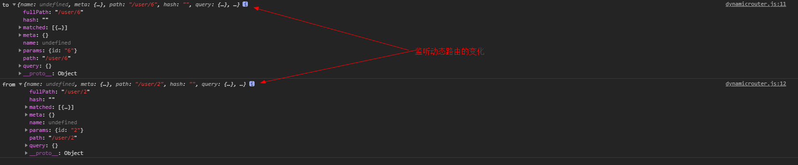

# 概述
Vue2.x学习笔记
# 参考
[Vue](https://cn.vuejs.org/)
[vueRouter](https://router.vuejs.org/zh/installation.html)

# VueRouter

## 安装使用

1.先下载，然后通过`script`引入或者直接只用CDN
```
<script src="../plugins/vue/vue.js"></script>
<script src="../plugins/vue/vue-router.js"></script>
```

2.通过`npm`安装
```
// 下载包
npm install vue-router
// 引入
import Vue from 'vue'
import VueRouter from 'vue-router'
// 在工程的项目中使用路由需要使用Vue.use()明确的安装
Vue.use(VueRouter)
```
## 使用

1.定义路由组件

```
const HOMe = { template: '<div>home</div>' }
const COLLECTION= { template: '<div>collection</div>' }
```

2.定义路由表

```
const routes = [
  {
    path: '/home',
    component: HOME
  },
  {
    path: '/collection',
    component: COLLECTION
  }
]
```

将路由与组件进行关联；

3.创建 router 实例
```
let router = new VueRouter({
  routes: routes
})
```
4.挂载
```
let vm = new Vue({
  el: '#app',
  router: router,
  data() {
  },
})
```
在根实例上注入路由，一遍所有的组件都可以使用；
5.在页面中使用`router-link`实现路由的切换
```
<ul class="demo-nav">
  <li><router-link to="/home">HOME</router-link></li>
  <li><router-link to="/collection">COLLECTION</router-link></li>
</ul>
```
6.定义路由出口
使用`router-view`来定义路由内容渲染的位置，即是页面的哪个位置渲染路由；
注意：在哪渲染路由，就需要把`router-view`放在哪里
## 路由访问
在组件内部可以通过
`this.$router` 访问路由对象


<br/>

`this.$route`访问当前路由


## 动态路由
把某种模式匹配到的所有路由，全都映射到同个组件；
即是同一个组件关联不同的路由；
实现：
配置动态路径参数”(dynamic segment)；
### 动态路径参数
单参数
```
/path/:param
```
多参数
```
/path/:param1/path/:param2
```
说明：当匹配到一个路由时，参数值会被设置到 `this.$route.params`，可以在每个组件内使用;

<strong>demo</strong>

`HTML`
```
<!-- 实际项目中参数1一般是动态的（id等） -->
 <section class="demo-main">
        <router-link to="/user/1">SHOWTABLE</router-link>
      <!-- 路由出口：路由匹配到的组件将渲染在这里 -->
    <router-view></router-view>
    </section>
```

`Router`配置
```
{
      path: '/user/:id',
      component: {
        data() {
          return {
            tableData: [{
              name: 'tom',
              age: 10,
              sex: 'male'
            }]
          }
        },
        template: `
        <el-table :data="tableData">
        <el-table-column label="name" prop="name"></el-table-column>
        <el-table-column label="sex" prop="sex"></el-table-column>
        <el-table-column label="age" prop="age"></el-table-column>
      </el-table>`
      }
    }
```

#### 响应路由参数的变化
> 提醒一下，当使用路由参数时，例如从 /user/foo 导航到 /user/bar，原来的组件实例会被复用。因为两个路由都渲染同个组件，比起销毁再创建，复用则显得更加高效。不过，这也意味着组件的生命周期钩子不会再被调用。


复用组件时，想对路由参数的变化作出响应的话，可以简单地 `watch` (监测变化) `$route` 对象：
```
 watch: {
    '$route': function(to, from) {
      console.log('to',to);
      console.log('from',from);
    }
  },
```

<br />
或者使用vue2.2中的路由守卫：

```
beforeRouteUpdate (to, from, next) {
    // react to route changes...
    // don't forget to call next()
  }
```

#### 路由匹配优先级
> 有时候，同一个路径可以匹配多个路由，此时，匹配的优先级就按照路由的定义顺序：谁先定义的，谁的优先级就最高。

## 嵌套路由

在路由表中配置`children`属性

```
{
      path: '/list',
      component: {
        template: `<h1>Nest Router</h1>`
      },
      children: [
        {
          path: 'info',
          component: {
            template: `<h2>info</h2>`
          }
        },
        {
          path: 'add',
          component: {
            template: `<h2>add</h2>`
          }
        }
      ]
    }

```

Q: 嵌套路由时，子路由的内容怎样渲染到对应的位置中？

## 编程式导航
定义导航链接的方式：
1.使用`router-link`,该标签最终被映射成`a`标签；
2.使用 `router.push()`实现；
### router.push
使用`router.push`会向history栈中添加一个新的记录，所以，当用户点击浏览器后退按钮时，则回到之前的 URL

注意：
在`Router`中，`path`和`params`不能同时出现，`query`可以和`path` 同时出现;

## 命名路由
通过设置`name`属性实现路由的命名；

```
 {
    path: '/personal',
    name: 'persobal',
    component: {
      template: '<h1>PERSONAL</h1>'
    }
  }
```

## 命名视图

(同级) 展示多个视图，而不是嵌套展示,通过多个`router-view`并将其`name`属性改为相应的组件名

即同一个路由对应不同的组件


```
const Foo = {
  template: `<div>Foo</div>`
}
const Bar = {
  template: `<div>Bar</div>`
}
const Baz = {
  template: `<div>Baz</div>`
}


{
  path: '/',
  components: {
    default: Foo,
    a: Bar,
    b: Baz
  }
}
```

## 重定向和别名

### 重定向
通过配置`redirect`属性来完成；

> “重定向”的意思是，当用户访问 `/a`时，`URL` 将会被替换成` /b`，然后匹配路由为 `/b`


```
{
  path: '/personal',
  name: 'persobal',
  redirect: '/person1',
  component: {
    template: '<h1>PERSONAL</h1>'
  }
}
```

### 别名
> `/a `的别名是` /b`，意味着，当用户访问 `/b` 时，`URL` 会保持为 `/b`，但是路由匹配则为 `/a`，就像用户访问 /a 一样。
“别名”的功能让你可以自由地将 UI 结构映射到任意的 URL，而不是受限于配置的嵌套路由结构。


```
{
  path: '/home',
  component: {
    template: '<h1>HOMe</h1>'
  },
  alias: '/index'
}

```

## 路由组建传参
> 在组件中使用 $route 会使之与其对应路由形成高度耦合，从而使组件只能在某些特定的 URL 上使用，限制了其灵活性。
使用 props 将组件和路由解耦：

```
const User = {
  template: '<div>User {{ $route.params.id }}</div>'
}
const router = new VueRouter({
  routes: [
    { path: '/user/:id', component: User }
  ]
})
```

```
const User = {
  props: ['id'],
  template: '<div>User {{ id }}</div>'
}
const router = new VueRouter({
  routes: [
    { path: '/user/:id', component: User, props: true },

    // 对于包含命名视图的路由，你必须分别为每个命名视图添加 `props` 选项：
    {
      path: '/user/:id',
      components: { default: User, sidebar: Sidebar },
      props: { default: true, sidebar: false }
    }
  ]
})
```

## HTML5 History 模式

> vue-router 默认 hash 模式 —— 使用 URL 的 hash 来模拟一个完整的 URL，于是当 URL 改变时，页面不会重新加载。


## 导航守卫

>“导航”表示路由正在发生改变；

> vue-router 提供的导航守卫主要用来通过跳转或取消的方式守卫导航


导航守卫： 检测正在改变的路由？？
